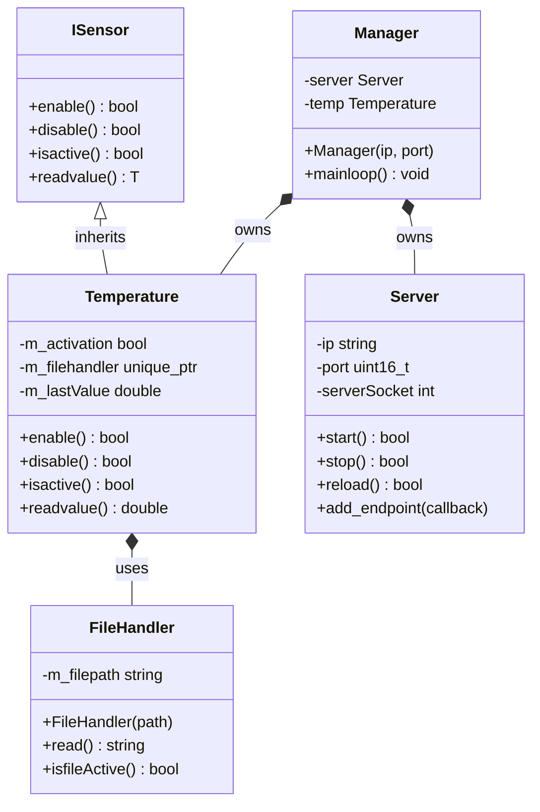

# Temperature Monitor

A lightweight C++ application for Raspberry Pi that reads the CPU temperature and exposes it over HTTP. Built with a clean object-oriented design using a sensor abstraction interface.

## Features

- Reads CPU temperature from the Linux sysfs interface
- Exposes temperature data over HTTP on port 8080
- Clean sensor abstraction via `ISensor<T>` interface
- Multithreaded: network server runs independently from the read loop
- Designed for embedded Linux (Yocto)

## Architecture

```
ISensor<T>  (interface)
    └── Temperature  ──uses──  FileHandler  ──reads──  /sys/class/thermal/thermal_zone0/temp
           ▲
           │ owns
        Manager  ──owns──  Server  (TCP socket on port 8080)
```

### Classes

| Class | Responsibility |
|---|---|
| `ISensor<T>` | Abstract sensor interface: `enable`, `disable`, `isactive`, `readvalue` |
| `FileHandler` | Reads a file from the filesystem — wraps the sysfs sensor file |
| `Temperature` | Implements `ISensor<double>`, converts raw millidegrees to °C |
| `Server` | TCP socket server running in its own thread, serves HTTP responses |
| `Manager` | Wires everything together and runs the main loop |

## Requirements

- C++17 or later
- CMake 3.16+
- pthread
- Linux target with `/sys/class/thermal/thermal_zone0/temp` (Raspberry Pi)

## Build

```bash
mkdir build && cd build
cmake ..
make
```

## Cross-compile with Yocto (Kirkstone)

Add the recipe to your layer:

```bash
# In your meta layer
recipes-temperature-monitor/
└── temperature-monitor/
    └── temperature-monitor.bb
```

Add to `conf/local.conf`:
```bitbake
IMAGE_INSTALL:append = " temperature-monitor"
```

Then build:
```bash
bitbake core-image-minimal
```

## Usage

```bash
# On Raspberry Pi
temperature-monitor
# Temperature: 45.2 C
# Temperature: 45.4 C
# ...

# Query from any machine on the network
curl http://<raspi-ip>:8080
# temperature=45.234C
```

## How It Works

1. `Manager` enables the `Temperature` sensor and registers it as an HTTP endpoint
2. `Temperature` uses `FileHandler` to read `/sys/class/thermal/thermal_zone0/temp`
3. The raw value (e.g. `45234`) is divided by 1000 to get degrees Celsius (`45.234`)
4. `Server` listens on port 8080, accepts connections, and responds with the latest reading
5. The main loop prints the temperature to stdout every 2 seconds

## Project Structure

```
temperature-monitor/
├── CMakeLists.txt
├── include/
│   ├── ISensor.hpp
│   ├── FileHandler.hpp
│   ├── Temperature.hpp
│   ├── Server.hpp
│   └── Manager.hpp
└── src/
    ├── FileHandler.cpp
    ├── Temperature.cpp
    ├── Server.cpp
    ├── Manager.cpp
    └── main.cpp
```

## Architecture



## License

MIT
